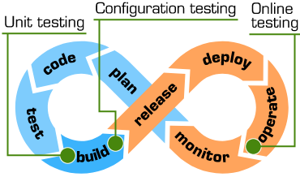
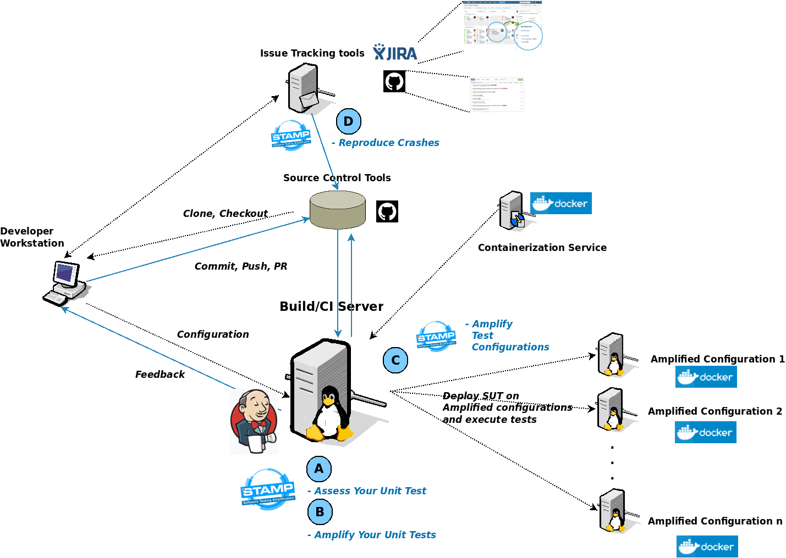

# STAMP CI demo

STAMP technology shows its full potential within CI/CD processes.  
The three pillars of software testing amplification (unit test amplification, configuration testing amplification, online testing amplification) can be activated to improve existing DevoPs processes:

This repository centralizes all material, documents, code and screencasts for the end to end demo of STAMP's ampliication technology in the CI.

The diagram below shows the Big Picture of this Software Testing AMPlification demo:

The demo demonstrates how:

1. A developer can automatically assess the capability if his test suite to detect bugs, using extreme mutation testing, thanks to a Jenkins pipeline which executes **[Descartes](https://github.com/STAMP-project/pitest-descartes)**;
1. A developer can leverage the CI server to automatically amplify his test suites, having he pushed a code change in the repo, thanks to a Jenkins pipeline which executes **[DSpot](https://github.com/STAMP-project/dspot/)**. At the end of test amplification, new test cases will be pushed back in the repo, in a separate branch, and a pull request will automatically be opened by Jenkins, in order to let the developer decide whether accept newly generated  tests cases in the code base or not;
1. A developer can leverage the CI server to automatically generate several test configurations, in order to test his code on different combination of middleware blocks (JVM, database, application server), thanks to a Jenkins pipeline which executes **[CAMP](https://github.com/STAMP-project/camp/)**. CAMP generates new configurations, and then executes test cases against the generated configurations, showing the result within Jenkins dashboard. Generated configurations are available as build artifacts which the developer can get and save in the code base;
1. a user can open an issue in a bug tracking system, attaching file containing the stacktarce, and automatically STAMP executes **[Botsing](https://github.com/STAMP-project/botsing)** to generate a test case able to reproduce the given stacktrace. Generated test case is attached to the opened issue, and the developer can use it to speed-up the investigation phase and then to fix the bug.

At the core of this scenario you find the CI/CD server, based on an instance of Jenkins, installed in the **[STAMP demo server](https://vmi2.stamp-project.eu/jenkins/)**.

