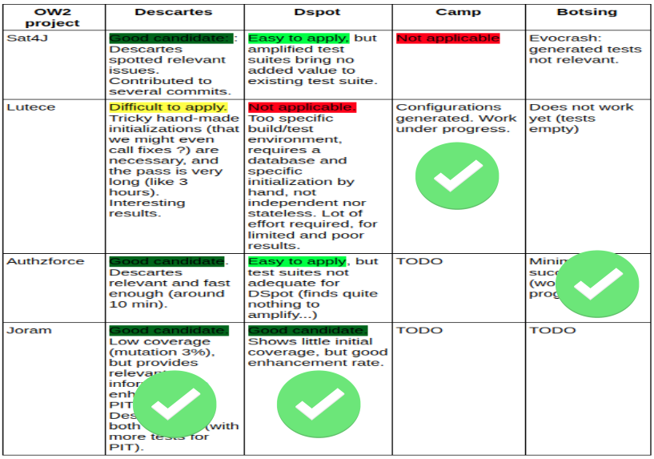

# Which are the real world projects leveraging STAMP in the CI?

OW2 performed an analysis of candidate projects from [its marketplace](https://projects.ow2.org/), making several experiments to apply STAMP tools to them.

At the end following projects have been selected:
  - [Joram](https://joram.ow2.io/), an open source implementation of JMS (Java Message Service) API specification, used to demonstrate DSpot and Descartes usage in CI processes
  - [Lutece](https://dev.lutece.paris.fr/), an open source portal engine, developed by the City of Paris, used to demonstrate CAMP usage in CD processes
  - [Authzforce](https://github.com/authzforce), an open source attribute-based access control framework, compliant with OASIS XACML 3.0, used to demonstrate Botsing usage in a CI scenario interacting with [Atlassian Jira Software](https://www.atlassian.com/it/software/jira) and [GitHub Issues](https://guides.github.com/features/issues/) issue trackers

In order to perform experiments, all these projects have been cloned in the STAMP GitHub space:

 - [Cloned Joram](https://github.com/STAMP-project/joram), cloned from [official Joram Gitlab repository](https://gitlab.ow2.org/joram)
  - [Cloned Lutece](https://github.com/STAMP-project/lutece-demo-site-forms), cloned from [official Lutece Demo site repository](https://github.com/lutece-platform/lutece-demo-site-forms)
  - [Cloned Authzforce](https://github.com/STAMP-project/authzforce-core), cloned from [official AuthzForce Core Gitlab repository](https://gitlab.ow2.org/authzforce/core/)
