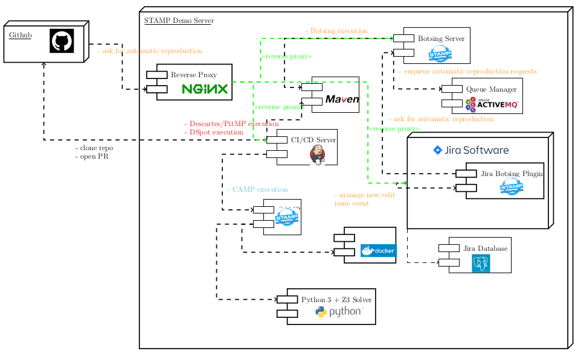

# Demo internals
Here you will discover how to setup this demo on your own premises.

The whole demo has been setup on a dedicated server made available by OW2, running Debian Jessie, and equipped with 8 GB and 4 CPUs.

The following diagram shows the Big Picture:

Below a short description of main components:
  - Jenkins CI: an instance of [Jenkins CI](https://jenkins.io/) has been installed, along with several plugins such
as:
    - [Blue Ocean](https://plugins.jenkins.io/blueocean): advanced tool to edit, visualize, diagnose Jenkins pipelines. Used for all
STAMP CI/CD developed pipelines (see as an example 2.3 or 2.10)
    - [HTML Publisher plugin](https://plugins.jenkins.io/htmlpublisher), used for instance to publish mutation coverage reports and JMeter reports within Jenkins
    - [GitHub plugin](https://plugins.jenkins.io/github): used to integrated Jenkins with GitHub and its APIs;
    - [Descartes Jenkins plugin](https://github.com/STAMP-project/stamp-ci/tree/master/descartes-jenkins-plugin): plugin developed during the project to show mutation
coverage trends across each build;
    - [DSpot Jenkins plugin](https://github.com/STAMP-project/stamp-ci/tree/master/dspot-jenkins-plugin): plugin developed during the project to configure Test Ampli-
fication with DSpot in freestyle jobs;
  - [Jira Software](https://www.atlassian.com/it/software/jira): an instance of Jira Software with a database based on PostgreSQL and a perpetual license for ten users. Botsing plugin has been installed within Jira itself;
  - [Docker](https://docs.docker.com/install/linux/docker-ce/debian/) and [Docker compose](https://github.com/docker/compose): latest available versions for Debian have been installed
  - [Python 3](https://www.python.org/): default Python installation (Python 2.7) has been replaced by Python 3, needed by CAMP
  - [CAMP](https://stamp-project.github.io/camp/)
  - [Botsing Server](https://github.com/STAMP-project/botsing-server)
  - web frontend, based on [NGINX](https://nginx.org/): to expose Jira Software, Jenkins CI, Botsing Server on ordinary 443 SSL port.
